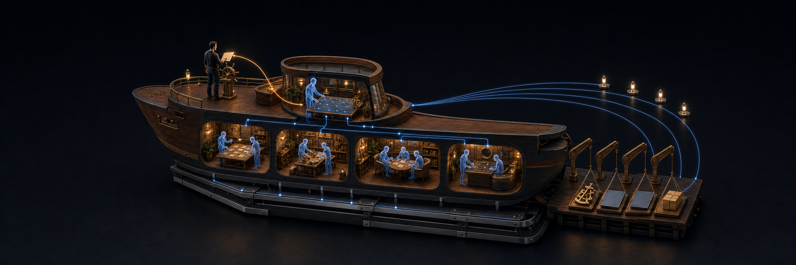

<p align="center">
  
</p>

<h1 align="center">AgentOS</h1>

<p align="center">
  <strong>Build autonomous companies.</strong>
</p>

<p align="center">
  The open-source company harness. What Pi is to one agent,<br>
  AgentOS is to the whole organization.
</p>

<p align="center">
  <a href="#get-started"><strong>Get started</strong></a> ·
  <a href="./VISION.md">Vision</a> ·
  <a href="./ARCHITECTURE.md">Architecture</a> ·
  <a href="./CONTRIBUTING.md">Contributing</a>
</p>

The agent was never the bottleneck. You are. One agent in one session works —
at the price of your full attention. The moment you want two, you become the
infrastructure: switching tabs, ferrying context between chats that can't see
each other, approving everything. The hard part isn't running more agents.
It's organizing them so they don't all run through you.

AgentOS is that organization: a persistent crew that works in parallel, each
agent briefed with the context its task needs — guided by outcomes, not
prescribed workflows, and gated where consequences live: money, merges,
credentials. Your attention is the most expensive thing in the company, and it
must be earned. What reaches you is progress with names on it and a short list
of decisions only you can make; attach to any agent's terminal whenever you
want the details. You're never out of the loop. You just stop being the loop.

## Get started

One prompt. Nothing to clone, nothing to install, nothing to study first.

**1. Copy this into the coding agent you already use:**

```text
Fetch and read https://raw.githubusercontent.com/akua-dev/agentos/main/BOOTSTRAP.md.
Help me bring AgentOS online. Inspect what I already have first, explain the choices in plain language, and ask before making changes.
```

**2. Answer its questions.** It inspects what you have, explains the real
choices in plain language, and asks before anything that costs money or trust.

**3. Meet your First Mate.** A persistent agent that survives the night,
remembers the company and answers when you return. From then on you speak in
outcomes, not workflows.

You need: a coding agent, a Kubernetes context (or let it help you create a
disposable one), and a browser for provider login. You don't need: this repo,
a CLI, Docker, Helm, or a PostgreSQL install.

## A hire, not a migration

Adopting AgentOS replaces nothing. Your repositories stay where they are; the
crew delivers ordinary pull requests through the workflow each project already
trusts, and your issues, boards and CI keep working untouched. Nothing runs on
autopilot because you started it: day one, the crew asks before anything
consequential, and authority grows only as standing rules you record. Start
with one repository, watch it work, widen its scope when it has earned it —
and if you walk away, everything is still yours and still standard:
coordination in a PostgreSQL database you own, delivered work in plain Git.

Nothing accepted by the company disappears into a chat transcript. Your chosen
tracker remains where humans plan and intervene. Once the crew accepts an
outcome, PostgreSQL records its accountable owner, handoffs and any Captain
decision that gates it. Git records what actually shipped. AgentOS connects
that chain of custody without replacing any of its parts.

## The crew

- **Captain** — you. Direction, priorities and every decision that matters.
  The only irreplaceable one.
- **First Mate** — your persistent company lead. Holds the truthful picture of
  everything in motion and turns intent into owned, coordinated work.
- **Second Mate** — a durable leader for one domain when the company outgrows
  one pair of hands.
- **Crewmate** — a specialist for one bounded piece of work. Delivers, then
  leaves the company stronger than it found it.

A crew, not a swarm. Every agent knows what it owns, who it answers to, and
which decisions are yours alone. The Captain is a role, not a headcount — hold
it alone, or stand a team behind it.

## The company loop

1. **Direction.** You describe what should become true — an outcome, not a
   workflow graph.
2. **Organization.** First Mate forms the right crew and gives the work owners.
3. **Execution.** Specialists investigate, build, review and ship in parallel,
   each accountable for a result.
4. **Reality.** What customers do, what production does, what the numbers say —
   it comes back to the company instead of dying in a notification tray.
5. **Learning.** The company gets better at being the company. The loop turns
   again.

The result is not a chatbot waiting for its next prompt. It's an organization
that keeps moving while you sleep, can explain exactly what it's doing, and
brings you the decisions that were genuinely yours to make.

## Why AgentOS

Underneath that is what every real organization runs on and no chat window has:

- **Continuity.** Homes, memory and unfinished work that survive disconnects,
  restarts and lost pods. Leave on Friday; the company still knows itself on
  Monday.
- **Responsibility.** Every piece of work has one accountable owner and a clear
  path back to you. Nothing important is orphaned, duplicated or quietly
  dropped.
- **Visibility.** Real terminals, real state. When something fails, you watch
  it fail and fix it — not stare at a dashboard that says "running."
- **Learning.** What the company discovers becomes how the company operates,
  instead of a paragraph you paste into every new prompt.

## Where this goes

For one person, leverage: an organization with the reach of a company, led by
setting direction instead of babysitting a wall of chats. For a team or an
org, the answer to the question everyone is suddenly asking: how do you
*actually run* long-lived agents — for weeks, across products, orchestrated —
without losing ownership, visibility or control? The ratio changes — a few
humans, many agents. The model doesn't.

The ladder is simple: Pi harnesses a model into an agent. AgentOS harnesses
agents into a company. Akua builds the factory on top — companies started,
operated and improved by persistent agent teams, with humans at the helm. The open project must stand on its own, and it does not phone
home. Read [`VISION.md`](./VISION.md) for the bets, the principles, how this
differs from personal assistants and self-improving workers, and the things we
refuse to build.

> [!NOTE]
> AgentOS is early and building in public. The operating model is real today;
> the complete product experience is still taking shape. If the gap between
> this page and the code bothers you — good. Come close it.

## Architecture

The implementation and its exact boundaries live in
[`ARCHITECTURE.md`](./ARCHITECTURE.md). Short version: your tracker holds the
human workflow, PostgreSQL holds accepted work and Fleet coordination,
Kubernetes runs what must keep running, and Git holds what shipped. Every agent
works a real terminal with real tools. No hidden orchestrator, no second source
of truth.

## Build with us

AgentOS is open source and shaped by the people who run it. Start with
[`CONTRIBUTING.md`](./CONTRIBUTING.md) — and if you'd rather prove us wrong
than help, fork it. Both move this forward.

## License

AgentOS is MIT licensed. Redistributed third-party programs retain their own licenses; see [`THIRD_PARTY_NOTICES.md`](./THIRD_PARTY_NOTICES.md) and [`THIRD_PARTY_SOURCES.md`](./THIRD_PARTY_SOURCES.md).
