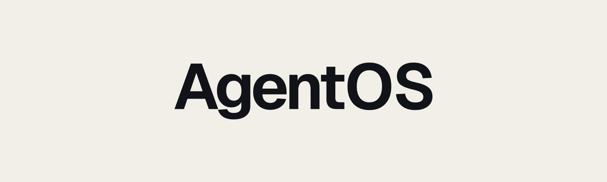
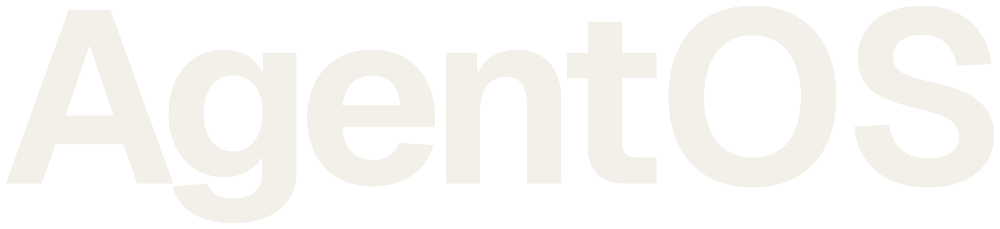

# AgentOS wordmark

The AgentOS identity is one continuous wordmark in one typographic voice. The
outlined SVGs in this directory are the production source of truth: they do not
depend on an installed font and use identical geometry in every colorway.

| Dark field | Light field |
| --- | --- |
|  |  |

| Transparent bone | Transparent ink |
| --- | --- |
|  |  |

## Files

| File | Use |
| --- | --- |
| [`agentos-wordmark-on-dark.svg`](./agentos-wordmark-on-dark.svg) | Complete `1600 × 480` dark presentation lockup |
| [`agentos-wordmark-on-light.svg`](./agentos-wordmark-on-light.svg) | Complete `1600 × 480` light presentation lockup |
| [`agentos-wordmark-bone.svg`](./agentos-wordmark-bone.svg) | Transparent wordmark for a sufficiently dark field |
| [`agentos-wordmark-ink.svg`](./agentos-wordmark-ink.svg) | Transparent wordmark for a sufficiently light field |
| [`agentos-browser-icon.svg`](./agentos-browser-icon.svg) | Browser-only utility source; never use as a standalone AgentOS mark |

The approved palette is:

| Token | Value | Use |
| --- | --- | --- |
| Bone | `#F2F0E9` | Dark-field wordmark |
| Near black | `#080A0E` | Dark field |
| Ink | `#111318` | Light-field wordmark |
| Warm off-white | `#F1EFE8` | Light field |

## Typography

The wordmark began with the open-source Geist Sans 1.8.0 grotesk at weight
`650`, then its letter relationships were fixed as outlines. `Agent` is tightly
spaced and `OS` is slightly calmer without changing typeface, weight, or color.
The master was shaped with Geist's native kerning, then optically adjusted by
`-0.052em` after the first four letters and `-0.022em` around `OS`.

Do not reconstruct the wordmark with live text or CSS letter spacing. Use an
SVG asset. In prose and interface copy, write the name exactly as `AgentOS`;
ordinary surrounding typography remains owned by the surface in which it
appears.

The source font is [Geist Sans 1.8.0](https://github.com/vercel/geist-font/tree/1.8.0),
created by Vercel with Basement Studio and Andrés Briganti and licensed under
the [SIL Open Font License 1.1](https://github.com/vercel/geist-font/blob/1.8.0/LICENSE.txt).
The production SVGs contain paths and require no font at runtime.

## Placement

Keep clear space of at least one capital `O` height on every side. The
transparent artwork has a tight view box; consumers own this surrounding clear
space.

Use the wordmark at no less than `120px` wide in digital layouts. No standalone
small-format symbol or monogram is defined. If a surface cannot fit the full
wordmark legibly, use the plain product name in that surface's ordinary text
style.

The favicon is the sole exception to the no-small-format-symbol rule. It uses
an ordinary Geist Sans `A` because browser chrome cannot fit the product name.
It is not part of the AgentOS wordmark and must not be reused as a logo, avatar,
product icon or interface ornament.

## Do and do not

- Keep the supplied shape, proportions, spacing, casing, and one-color
  treatment unchanged.
- Use the complete field lockups when their fixed aspect ratio fits; otherwise
  place the matching transparent asset on a field with strong contrast.
- Do not recolor, separate, enlarge, or decorate `OS`.
- Do not stretch, skew, rotate, outline, shadow, glow, mask, or re-track the
  wordmark.
- Do not extract a letter, ligature, monogram, or standalone symbol.
- Do not attach a domain, slogan, descriptor, or unapproved supporting copy to
  the lockup.

## Accessibility

When the wordmark communicates the product name, give it the alternate text
`AgentOS`:

```html

```

When adjacent visible text already names AgentOS, avoid announcing the name
twice:

```html

```
